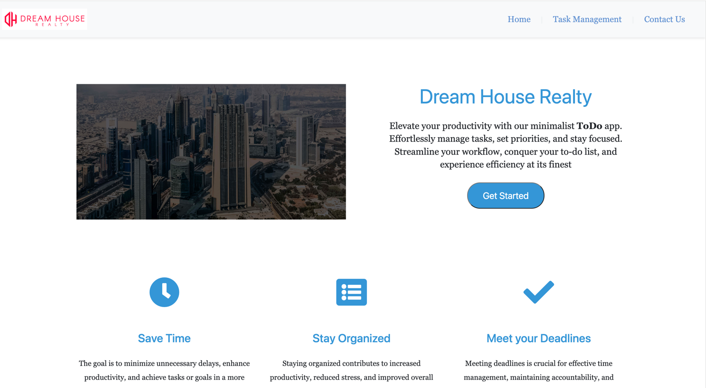

# Todo Task Management Application

## Overview

The Todo Application is a simple task management tool designed to help you organize and prioritize your tasks efficiently.


## Features

- **Add Task:** Users can add new tasks with a title, description, due date, and priority.
- **Mark as Completed:** Tasks can be marked as completed by checking the corresponding checkbox.
- **Delete Task:** Remove unwanted tasks from the list.
- **Priority Categories:** Tasks are categorized based on priority (High, Medium, Low).
- **Due Dates:** Set due dates for tasks to prioritize your workload.
- **Responsive UI:** The application provides a responsive and user-friendly interface.

## Technologies Used

- **Java 17:** The latest version of Java for application development.
- **Apache Wicket:** A lightweight and component-based Java web framework.
- **Lombok:** A library to reduce boilerplate code in Java, making code more concise and readable.
- **Postgresql:** DBMS for data storage
- **Hibernate:** Database layer to persist data in efficent way
- **Guice:** Guice used for Dependency injection make it easy and clean code
- **Bootstrap:** Bootstrap framework use  to enhance the styling and layout of Application

## Setup

1. **Clone the Repository:**
   ```bash
   git clone https://github.com/yasirshabbir44/todo-app-wicket
   cd todp-app-wicket
2. **Build and Run:**
   ```bash
   mvn clean install
   mvn jetty:run

**Access the Application:**

Open your web browser and navigate to http://localhost:8080.

